# Zero-Infrastructure Priority Queue Proposal

## Executive Summary

This proposal outlines a **zero-footprint priority queue solution** that requires NO new infrastructure, NO new services, and NO DevOps support. The solution runs entirely within your existing monolith using only your current Redis and MongoDB instances.

**Key Deliverable**: A lightweight module (~300 lines) that prioritizes premium customers over free customers, deployable in 4 days without any infrastructure changes.

## Problem Statement

### Current Pain Points

Your monolith currently processes jobs in a first-in, first-out (FIFO) manner, treating all customers equally regardless of their subscription tier. This creates several critical business problems:

1. **Premium Customer Dissatisfaction**: Customers paying for premium service experience the same wait times as free users, leading to complaints and potential churn
2. **Revenue Risk**: Without differentiated service levels, there's little incentive for free users to upgrade to premium
3. **Resource Inefficiency**: High-value customers compete for the same resources as free users who generate no revenue
4. **SLA Violations**: Unable to guarantee faster processing times for premium customers as promised in service agreements

### Business Impact

Based on typical SaaS metrics, the current situation likely results in:
- **5-10% premium customer churn** due to poor service differentiation
- **Missed upsell opportunities** - free users don't experience the value of premium
- **Support ticket volume** from premium customers expecting faster service
- **Competitive disadvantage** against solutions offering proper tier-based prioritization

## Solution Overview

### Core Approach

We propose implementing a **priority scoring system** directly within your monolith that intercepts job submissions and routes them through a priority queue. This approach requires:

- **Zero new infrastructure** - Uses only existing Redis and MongoDB
- **Minimal code changes** - Add one module, modify 2-3 existing lines
- **Instant rollback** - Feature flag enables/disables in seconds
- **No operational overhead** - No new services to monitor or maintain

### How It Works

The solution implements a simple but effective priority mechanism:

1. **Job Submission**: When a job is submitted, the module checks the customer's tier from MongoDB
2. **Priority Assignment**: Premium customers receive a priority score of 1000, free customers receive 100
3. **Queue Management**: Jobs are stored in Redis using sorted sets, which naturally order by priority
4. **Job Processing**: Workers pull the highest priority job first, ensuring premium customers are served first
5. **Fairness Mechanism**: 10% of dequeue operations randomly select from the bottom to prevent complete starvation

### Why This Architecture

We chose this embedded module approach over alternatives for several reasons:

**Why not a separate service?**
- Requires new deployment infrastructure
- Adds network latency
- Creates additional failure points
- Needs DevOps support (unavailable with SRE on leave)

**Why not a message queue (RabbitMQ/Kafka)?**
- Requires new infrastructure provisioning
- Adds operational complexity
- Overkill for simple priority requirements
- Learning curve for team

**Why not cloud services (AWS SQS)?**
- Vendor lock-in
- Ongoing costs
- Limited priority support
- Requires AWS account setup and permissions

**Why Redis sorted sets?**
- Already in your infrastructure
- Native priority support via scores
- O(log n) insertion and removal
- Atomic operations prevent race conditions
- Battle-tested at scale

## Visual Architecture Overview

### Current State vs Proposed State

The fundamental problem with your current system is that all jobs are processed in First-In-First-Out (FIFO) order, regardless of customer tier. This means a premium customer's critical job might wait behind hundreds of free-tier requests. Our proposed solution introduces a priority-based ordering without changing your infrastructure.


**Key Changes:**
- **Current State**: Jobs execute in submission order. Premium customers (shown in peach) are stuck behind free customers, leading to poor service levels for your highest-value customers.
- **Proposed State**: Jobs are automatically reordered by priority. Premium jobs (shown in green) jump to the front of the queue with a score of 1000, while free jobs queue behind them with a score of 100.

This simple numerical scoring system (1000 vs 100) creates a 10x priority difference, ensuring premium customers always get processed first while still allowing free tier jobs to execute when no premium jobs are waiting.

### System Architecture - Zero New Infrastructure

The beauty of this solution is its simplicity: we're adding a thin priority layer within your existing monolith without any new infrastructure requirements. The priority module acts as an intelligent router that intercepts jobs and manages their execution order.


**Architecture Explanation:**

The Priority Module is a lightweight component (approximately 300 lines of TypeScript) that integrates seamlessly with your existing application:

1. **API Layer**: Remains unchanged - continues to receive requests as before
2. **Business Logic**: Modified with a simple feature flag check - if enabled, routes jobs through the priority module; if disabled, uses existing logic
3. **Priority Module**: The only new component, uses Redis Sorted Sets for queue management
4. **Redis**: Your existing Redis instance stores the priority queue using native Sorted Set data structures
5. **MongoDB**: Your existing MongoDB reads customer tier information (already stored)
6. **Worker Process**: Modified to pull jobs from the priority queue instead of direct processing

**Why This Works Without New Infrastructure:**
- Redis Sorted Sets are a built-in data type, requiring no additional setup
- The module runs in-process within your monolith (no new services)
- MongoDB queries remain read-only for customer tier lookup
- No new network connections, ports, or security configurations needed

## Data Flow Diagrams

### Job Submission Flow

Understanding how jobs flow through the system is crucial for implementation. The sequence diagram below shows the complete journey from job submission to queuing, with the feature flag providing a safe toggle between old and new behavior.


**Detailed Flow Explanation:**

1. **Client Submission**: Customer submits a job through your existing API - no changes needed on the client side

2. **Tier Lookup**: The monolith queries MongoDB to determine the customer's tier. This is likely already happening in your system for billing or feature access. We're simply reusing this existing data.

3. **Feature Flag Decision Point**: This is your safety valve. When `USE_PRIORITY_QUEUE=true`, jobs route through the new priority system. When false, the system behaves exactly as it does today.

4. **Priority Calculation**: Dead simple - Premium customers get score 1000, Free get 100. No complex algorithms that could fail or cause delays.

5. **Redis Operations**: 
   - `ZADD`: Adds the job to a sorted set with its priority score. Redis automatically maintains sort order.
   - `SET with TTL`: Stores job data with automatic expiration after 24 hours to prevent memory leaks

6. **Response**: Client receives the same job ID response - the priority handling is completely transparent

### Job Processing Flow with Anti-Starvation

One risk with priority queues is starvation - low priority jobs never getting processed. Our solution includes a simple but effective anti-starvation mechanism that ensures fairness while maintaining premium priority.


**Processing Strategy Explained:**

The worker process runs in a continuous loop, but with intelligent job selection:

1. **Feature Flag Check**: First, we check if the priority queue is enabled. This allows instant rollback to legacy behavior without code deployment.

2. **The 90/10 Rule**: This is our anti-starvation mechanism:
   - **90% of the time**: Workers use `ZPOPMAX` to get the highest priority job (premium customers)
   - **10% of the time**: Workers use `ZPOPMIN` to get the lowest priority job (ensures free tier jobs eventually process)

3. **Why This Works**:
   - Premium jobs still get 9x more processing capacity
   - Free tier jobs have a guaranteed processing window
   - No job can be stuck indefinitely
   - Simple random check - no complex state management

4. **Job Processing**: Once selected, jobs process through your existing logic - no changes needed

5. **Automatic Cleanup**: Redis TTLs ensure completed jobs don't consume memory. No manual cleanup needed.

## Implementation Timeline

### 4-Day Implementation Plan

The timeline below shows a realistic, day-by-day breakdown of the implementation. Each day has clear deliverables with buffer time for testing and refinement.


**Detailed Daily Breakdown:**

### Day 1: Core Module Development (8 hours)

**Morning (4 hours): Create Priority Module**
- Write the PriorityQueueModule class (~200 lines)
- Implement enqueue/dequeue operations using Redis Sorted Sets
- Add priority calculation logic (Premium=1000, Free=100)
- Create basic error handling and logging

**Afternoon (4 hours): Unit Testing**
- Test priority ordering works correctly
- Verify Redis operations are atomic
- Test edge cases (empty queue, same priorities)
- Mock Redis for fast unit tests
- Ensure 90/10 fairness mechanism works

**Day 1 Deliverable**: A working, tested module that can prioritize jobs (not yet integrated)

### Day 2: Integration & Safety Mechanisms (8 hours)

**Morning (3 hours): Integration Points**
- Identify where jobs are currently submitted in your monolith
- Add conditional routing: `if (USE_PRIORITY_QUEUE) { ... }`
- Modify worker loop to pull from priority queue
- Ensure backward compatibility

**Midday (2 hours): Feature Flag Setup**
- Add environment variable checking
- Implement hot-reload capability if possible
- Test flag enables/disables cleanly
- Verify no impact when disabled

**Afternoon (3 hours): Basic Monitoring**
- Add metric collection (queue depth, tier counts)
- Integrate with existing logging
- Create simple health check endpoint
- Set up basic alerting thresholds

**Day 2 Deliverable**: Integrated system that can be toggled on/off safely

### Day 3: Migration & Real-World Testing (8 hours)

**Morning (3 hours): Migration Script**
- Write script to identify pending jobs
- Calculate priorities for existing jobs
- Batch insert into Redis queue
- Handle duplicates gracefully

**Afternoon (5 hours): Testing with Real Data**
- Run with subset of production data
- Verify premium jobs process first
- Check memory usage stays within bounds
- Test rollback procedures
- Validate monitoring metrics

**Day 3 Deliverable**: System proven with real data, migration path tested

### Day 4: Production Readiness (7 hours)

**Morning (3 hours): Load Testing**
- Simulate production load (1000+ concurrent jobs)
- Verify Redis memory usage acceptable
- Check processing rates meet requirements
- Test sustained load over time

**Early Afternoon (2 hours): Documentation**
- Write operation guide for your team
- Document monitoring procedures
- Create runbook for common issues
- Update system architecture docs

**Late Afternoon (2 hours): Rollback Plan Test**
- Practice Option 1: Feature flag disable
- Practice Option 2: Queue clear
- Time each rollback method
- Document rollback procedures

**Evening: Go Live**
- Enable for small percentage of customers
- Monitor metrics closely
- Be ready to rollback if needed

**Day 4 Deliverable**: Production-ready system with full documentation

## Priority Queue Mechanism

### How Priority Scoring Works

The core of our solution is a simple numerical scoring system that leverages Redis's native Sorted Set data structure. This isn't a complex algorithm that could fail or be hard to debug - it's basic arithmetic that's been proven in production systems for years.


**The Scoring Logic:**

Our priority scoring is intentionally simple to ensure reliability and predictability:

1. **Customer Tier Lookup**: We read the customer's tier from MongoDB (this data already exists for billing purposes)

2. **Score Assignment**:
   - **Premium Customers**: Receive a score of 1000
   - **Free Customers**: Receive a score of 100
   - The 10x difference ensures clear prioritization without complex calculations

3. **Redis Sorted Set Storage**: Redis's ZADD command automatically maintains jobs in score order. This is a O(log n) operation - extremely fast even with thousands of jobs.

4. **Queue State**: Jobs are automatically ordered by score. When workers request jobs, premium jobs (score 1000) always come before free jobs (score 100).

**Why These Specific Numbers?**

- **1000 vs 100**: Provides clear separation with room for future tiers (e.g., Enterprise at 1500)
- **Not 1 vs 2**: The large gap makes debugging easier and allows for future priority adjustments
- **Not Complex Formulas**: Simple numbers mean fewer bugs and easier troubleshooting

### Starvation Prevention Mechanism

Priority queues have an inherent risk: low-priority jobs might never execute if high-priority jobs keep arriving. Our solution includes a simple but effective prevention mechanism.


**How Starvation Prevention Works:**

The mechanism is elegantly simple - a random number generator ensures fairness:

1. **Worker Decision Point**: Each time a worker needs a job, it generates a random number

2. **The 90/10 Split**:
   - **90% probability**: Worker takes the highest priority job (`ZPOPMAX`)
   - **10% probability**: Worker takes the lowest priority job (`ZPOPMIN`)

3. **Why This Ratio?**
   - Premium customers still get 9x more processing power
   - Free tier jobs are guaranteed to process eventually
   - Simple to implement and understand
   - No complex aging algorithms that could fail

4. **Guaranteed Progress**: Even if premium jobs arrive continuously, free tier jobs will process in that 10% window

**Alternative Approach (If Needed):**

If 90/10 proves insufficient, you can implement time-based aging where job priorities increase over time:
- Every minute, increase all job scores by 10 points
- Free tier jobs (starting at 100) eventually reach premium levels (1000) after ~90 minutes
- This ensures no job waits forever, regardless of load

## Redis Memory Impact

### Memory Usage Breakdown

One of the key concerns when adding functionality to existing infrastructure is resource consumption. Our priority queue design is specifically optimized for minimal memory footprint.


**Memory Analysis:**

Your Redis instance currently has approximately 10% free memory. Our priority queue will consume less than 5% of total Redis memory because:

1. **Transient Data Only**: Jobs exist in Redis only while waiting to be processed. Once processed, they're immediately removed.

2. **Efficient Storage**: Each job in the queue requires only:
   - Sorted set entry: ~100 bytes (job ID + score)
   - Job data: ~1-2 KB (stored with TTL)
   - Total per job: ~2 KB maximum

3. **Automatic Bounds**: With a processing rate of 100 jobs/second and average queue time of 10 seconds, you'd have ~1000 jobs in queue, consuming only ~2 MB.

4. **No Growth Over Time**: Unlike caches that grow continuously, the queue size is bounded by your processing rate.

### Data Lifecycle with Auto-Cleanup

Memory leaks are impossible due to our defensive design using Redis TTLs (Time To Live) on all data.


**Lifecycle Stages Explained:**

1. **Job Creation**: When a job enters the system, it's added to the Redis sorted set (queue) and its data is stored with a 24-hour TTL

2. **Active Queue**: While waiting, the job occupies minimal memory in the sorted set structure

3. **Processing**: When a worker claims the job via ZPOPMAX/ZPOPMIN, it's removed from the queue (freeing sorted set memory)

4. **Post-Processing**: Job data remains in Redis for 24 hours for debugging/audit purposes, then automatically expires

5. **Automatic Cleanup**: Redis handles expiration in the background - no cleanup scripts needed

**Why This Prevents Memory Issues:**

- **No Accumulation**: Jobs can't pile up indefinitely - they either process or expire
- **Bounded Growth**: Queue size is limited by processing rate, not by time
- **Self-Healing**: Even if workers stop, TTLs ensure memory is eventually reclaimed
- **No Manual Intervention**: No need for cleanup cron jobs or maintenance windows

## Rollback Strategy

### Instant Rollback Flow

One of the most critical aspects of any production deployment is the ability to quickly revert if issues arise. Our solution provides multiple rollback options that can be executed in under a minute without any data loss.

```mermaid
flowchart TD
    Problem[Issue Detected] --> Action{Rollback Method}
    
    Action -->|Option 1| Env[Set USE_PRIORITY_QUEUE=false]
    Action -->|Option 2| Clear[Clear Redis Queue]
    
    Env --> Restart[Restart Monolith<br/>or Hot Reload]
    Clear --> Redis[redis-cli DEL pq:queue]
    
    Restart --> Normal[System Using<br/>Original Logic]
    Redis --> Recover[Jobs Recovered<br/>from MongoDB]
    
    Normal --> Working[✓ System Operational]
    Recover --> Working
    
    style Env fill:#90EE90
    style Working fill:#90EE90
    
    Note[Time to Rollback: < 1 minute]
```



**Rollback Options Explained:**

We provide two rollback mechanisms, each suited for different scenarios:

**Option 1: Feature Flag Disable (Recommended)**
- **How**: Set environment variable `USE_PRIORITY_QUEUE=false`
- **When to use**: Any unexpected behavior or performance issue
- **Time to execute**: 30 seconds
- **Process**:
  1. Change environment variable
  2. Restart monolith (or hot-reload if supported)
  3. System immediately reverts to original FIFO processing
  4. Jobs in Redis queue remain but are ignored
  5. New jobs process through legacy path

**Option 2: Queue Clear**
- **How**: Execute `redis-cli DEL pq:queue`
- **When to use**: Queue corruption or if you need to reprocess all jobs
- **Time to execute**: 5 seconds
- **Process**:
  1. Delete the Redis queue key
  2. System continues using priority logic but queue is empty
  3. Jobs can be re-submitted from MongoDB if needed
  4. No restart required

**Why Rollback is Safe:**

1. **No Data Loss**: Jobs exist in MongoDB regardless of queue state
2. **Immediate Effect**: Changes take effect instantly
3. **No Dependencies**: Doesn't require coordination with other services
4. **Reversible**: Can re-enable priority queue anytime
5. **Zero Downtime**: Option 2 doesn't even require a restart

## Monitoring Dashboard Concept

### Key Metrics to Track

Monitoring is crucial for any production system. Our solution requires only simple Redis commands to track health - no complex monitoring infrastructure needed.


**Essential Metrics and How to Get Them:**

1. **Queue Metrics** (Real-time Redis queries):
   - `ZCARD pq:queue` - Total jobs waiting
   - `ZCOUNT pq:queue 900 2000` - Premium jobs (scores 900-2000)
   - `ZCOUNT pq:queue 0 200` - Free jobs (scores 0-200)
   
   These can be queried every 10 seconds with negligible performance impact.

2. **Performance Metrics** (Calculated from logs):
   - **Jobs/Minute**: Count of processed jobs from your existing application logs
   - **Average Latency**: Time from enqueue to dequeue (track in job data)
   - **Wait Time by Tier**: Separate tracking for premium vs free

3. **Health Indicators**:
   - **Redis Memory**: Already monitored by your ops team
   - **Error Rate**: Count of failed jobs / total jobs
   - **Feature Flag Status**: Simple environment variable check

**Alert Thresholds and Actions:**

**Warning Level (Yellow Alert):**
- **Condition**: Queue depth > 1000 jobs
- **Meaning**: Processing might be falling behind
- **Action**: Check worker health, consider adding workers
- **Notification**: Slack message to dev team

**Critical Level (Red Alert):**
- **Condition**: Premium wait time > 30 seconds OR Redis memory > 90%
- **Meaning**: SLA violation imminent or resource exhaustion
- **Action**: Immediate investigation required
- **Notification**: PagerDuty alert to on-call engineer

**Implementation Note**: 

These metrics can be collected with a simple monitoring script (50 lines of code) that runs alongside your monolith:

```typescript
// Simple monitoring example
setInterval(async () => {
  const depth = await redis.zcard('pq:queue');
  const premiumCount = await redis.zcount('pq:queue', 900, 2000);
  const freeCount = await redis.zcount('pq:queue', 0, 200);
  
  // Log to your existing metrics system
  logger.metrics({
    queue_depth: depth,
    premium_jobs: premiumCount,
    free_jobs: freeCount
  });
  
  // Alert if needed
  if (depth > 1000) {
    alerting.warn('Queue depth exceeds threshold');
  }
}, 10000); // Every 10 seconds
```

## Current Situation Assessment

### What You Have
- **Monolith application** (Node.js + TypeScript)
- **Redis instance** (already running)
- **MongoDB instance** (already running)
- **No SRE availability** (cannot provision anything new)
- **No budget for paid solutions** (100% open source required)

### What You Need
- Premium customers prioritized over free customers
- No service interruption during implementation
- No additional operational overhead
- Solution that works with existing infrastructure

## Proposed Solution: Embedded Priority Module

### Core Concept
Instead of building a separate service or requiring new infrastructure, we'll create a **lightweight priority module that lives inside your existing monolith**. This module will intercept job submissions and route them through a priority queue using your existing Redis.

### Architecture Overview

```
Current Architecture:
Monolith → Direct Job Processing → Customers

Proposed Architecture:
Monolith → Priority Module (using existing Redis) → Job Processing → Customers
```

### Key Design Decisions

#### 1. **No New Infrastructure**
- Uses your existing Redis for queue storage
- Uses your existing MongoDB for configuration and metrics
- Runs as a module inside your monolith process
- No new ports, services, or containers needed

#### 2. **Minimal Code Changes**
- Add 3-4 new files to your monolith
- Change 2-3 lines where jobs are currently submitted
- No changes to deployment process
- No changes to monitoring/logging infrastructure

#### 3. **Progressive Rollout**
- Start with feature flag (environment variable)
- Can disable instantly without code changes
- Gradual customer migration possible
- Fallback to existing logic always available

## Implementation Strategy

### Development Approach

The implementation follows a **progressive enhancement strategy** where each day builds upon the previous day's work, with working code at every stage. This approach minimizes risk and allows for early validation.

### Module Internal Architecture


### Phase 1: Embedded Module (Day 1)
**Objective**: Create the core priority queue functionality

**Detailed Activities**:
- **Morning (4 hours)**:
  - Create `PriorityQueueModule` class with basic enqueue/dequeue operations
  - Implement priority calculation logic (simple tier-based scoring)
  - Add Redis connection management using existing connection pool
  - Write unit tests for queue operations

- **Afternoon (4 hours)**:
  - Implement job data serialization/deserialization
  - Add error handling and retry logic
  - Create basic logging for debugging
  - Run integration tests with local Redis

**Success Criteria**:
- Queue module can enqueue jobs with different priorities
- Dequeue operation returns highest priority job first
- All operations are atomic and thread-safe
- Tests pass with 100% coverage of critical paths

**Risk Mitigation**:
- If Redis sorted sets perform poorly, fallback to multiple lists (one per priority)
- If serialization is complex, use simple JSON.stringify initially

### Phase 2: Integration Points (Day 2)
**Objective**: Connect the priority queue to existing job flow

**Detailed Activities**:
- **Morning (4 hours)**:
  - Identify current job submission code (likely 1-2 locations)
  - Add conditional logic to route through priority queue when feature flag enabled
  - Modify worker loop to pull from priority queue instead of current source
  - Ensure backward compatibility with existing job format

- **Afternoon (4 hours)**:
  - Implement anti-starvation mechanism (10% random selection from bottom)
  - Add metrics collection (queue depth, processing rate)
  - Create health check endpoint
  - Test with real job payloads

**Integration Code Changes Required**:
```typescript
// Before (existing code)
async submitJob(jobData) {
    return this.jobService.process(jobData);
}

// After (with priority queue)
async submitJob(jobData) {
    if (process.env.USE_PRIORITY_QUEUE === 'true') {
        return this.priorityQueue.addJob(jobData);
    }
    return this.jobService.process(jobData);
}
```

**Success Criteria**:
- Jobs flow through priority queue when enabled
- System functions normally when feature flag disabled
- No performance degradation observed
- Metrics show premium jobs processed first

### Phase 3: Data Migration (Day 3)
**Objective**: Migrate existing pending jobs and test at scale

**Detailed Activities**:
- **Morning (4 hours)**:
  - Write migration script to move pending jobs to priority queue
  - Query MongoDB for all unprocessed jobs
  - Determine customer tier for each job
  - Batch insert into Redis with appropriate priorities

- **Afternoon (4 hours)**:
  - Run migration in test environment
  - Load test with 10,000+ jobs
  - Monitor Redis memory usage
  - Validate priority ordering works at scale

**Migration Strategy**:
```typescript
async function migratePendingJobs() {
    const pendingJobs = await mongodb.collection('jobs')
        .find({ status: 'pending' })
        .toArray();
    
    for (const batch of chunk(pendingJobs, 100)) {
        const pipeline = redis.pipeline();
        
        for (const job of batch) {
            const customer = await getCustomer(job.customerId);
            const priority = customer.tier === 'premium' ? 1000 : 100;
            pipeline.zadd('pq:queue', priority, job.id);
            pipeline.set(`pq:job:${job.id}`, JSON.stringify(job), 'EX', 86400);
        }
        
        await pipeline.exec();
    }
}
```

**Success Criteria**:
- All pending jobs successfully migrated
- No data loss during migration
- Redis memory usage within acceptable limits
- System handles production-level load

### Phase 4: Validation & Monitoring (Day 4)
**Objective**: Ensure production readiness and establish monitoring

**Detailed Activities**:
- **Morning (4 hours)**:
  - Create operational dashboards using existing tools
  - Document runbook for common scenarios
  - Test rollback procedure multiple times
  - Verify metrics are being collected correctly

- **Afternoon (4 hours)**:
  - Conduct end-to-end testing with production data copy
  - Performance testing with expected peak load
  - Security review of new code
  - Knowledge transfer session with team

**Monitoring Setup**:
- Queue depth by tier (premium vs free)
- Average wait time by tier
- Job processing rate
- Error rate and retry statistics
- Redis memory consumption

**Documentation Deliverables**:
- Operations runbook
- Troubleshooting guide
- Architecture decision record
- Performance benchmarks

## Technical Architecture

### System Design Principles

The architecture follows these key principles:

1. **Simplicity First**: Use the simplest solution that solves the problem
2. **Zero Dependencies**: No new infrastructure or services
3. **Fail-Safe**: System continues working even if priority queue fails
4. **Observable**: All operations are logged and monitored
5. **Reversible**: Can disable instantly without data loss

### Data Storage Layout

#### Redis (Existing Instance)

**Current Redis Usage Analysis**:
```
Current Redis Usage:
- Session data: ~20% memory (2GB of 10GB)
- Cache data: ~60% memory (6GB of 10GB)
- Other: ~10% memory (1GB of 10GB)
- Free: ~10% memory (1GB available)

Added by Priority Queue:
- Queue data: <5% memory (500MB max)
- Transient, not persistent
- Auto-expires after 24 hours
```

**New Redis Keys Structure**:

1. **Priority Queue** (`pq:queue`)
   - Type: Sorted Set
   - Score: Priority value (100-2000)
   - Member: Job ID
   - TTL: None (members removed on processing)
   - Size: ~100 bytes per job

2. **Job Data** (`pq:job:{jobId}`)
   - Type: String (JSON serialized)
   - Content: Full job payload
   - TTL: 24 hours (auto-cleanup)
   - Size: 500-1000 bytes per job

3. **Statistics** (`pq:stats`)
   - Type: Hash
   - Fields: enqueued, processed, failed, etc.
   - TTL: None (permanent counters)
   - Size: < 1KB total

**Memory Calculation Example**:
```
For 10,000 jobs in queue:
- Queue sorted set: 10,000 × 100 bytes = 1MB
- Job data: 10,000 × 1KB = 10MB
- Total Redis overhead: ~11MB (1.1% of available memory)
```

#### MongoDB (Existing Instance)

**No New Collections Required**. The solution only reads from existing collections:

```javascript
// Existing customer collection (READ ONLY)
{
  _id: ObjectId("..."),
  customerId: "cust_123",
  tier: "premium", // or "free"
  // ... other existing fields
}

// Existing jobs collection (READ ONLY for tier lookup)
{
  _id: ObjectId("..."),
  jobId: "job_456",
  customerId: "cust_123",
  status: "pending",
  // ... other existing fields
}
```

### Resource Impact Analysis

**CPU Impact Assessment**:
- Base overhead: < 0.5% CPU increase
- Per job overhead: ~0.1ms computation
- At 1000 jobs/second: ~100ms CPU time/second
- Conclusion: Negligible impact on modern hardware

**Memory Impact Breakdown**:
```
Worst-case scenario (100,000 queued jobs):
- Redis sorted set: 10MB
- Job data cache: 100MB  
- Total: 110MB (11% of available Redis memory)
- Safety margin: 890MB remaining
```

**Network Impact Analysis**:
- No new connections (uses existing pools)
- Additional Redis commands: 2 per job
- Bandwidth increase: < 1% at peak load
- Latency addition: < 5ms per operation

**Disk Impact**:
- Zero persistent storage required
- No new log files (uses existing logs)
- No database storage increase
- Redis persistence unchanged (if enabled)

### Algorithm Details

#### Priority Calculation

The priority score determines job processing order:

```typescript
function calculatePriority(job: Job): number {
    // Base tier scoring
    const tierScores = {
        'premium': 1000,
        'free': 100
    };
    
    let priority = tierScores[job.customerTier] || 100;
    
    // Future enhancement placeholders
    // priority += job.urgent ? 500 : 0;
    // priority += job.slaDeadline ? 200 : 0;
    // priority *= job.customerValue || 1.0;
    
    return priority;
}
```

#### Anti-Starvation Mechanism

Prevents free tier jobs from waiting indefinitely:

```typescript
function selectDequeueStrategy(): string {
    const random = Math.random();
    
    // 90% of time: highest priority (ZPOPMAX)
    // 10% of time: lowest priority (ZPOPMIN)
    return random < 0.9 ? 'ZPOPMAX' : 'ZPOPMIN';
}
```

This ensures:
- Premium jobs processed first 90% of the time
- Free jobs guaranteed processing 10% of the time
- Maximum wait time bounded even under heavy load

#### Concurrency Control

The solution handles concurrent workers safely:

```typescript
// Atomic dequeue using Redis commands
async function atomicDequeue(): Promise<Job> {
    // ZPOPMAX is atomic - no race conditions
    const jobId = await redis.zpopmax('pq:queue');
    
    // Fetch and delete job data atomically
    const jobData = await redis.getdel(`pq:job:${jobId}`);
    
    return JSON.parse(jobData);
}
```

No distributed locks needed due to Redis atomic operations.

## Risk Mitigation

### What Could Go Wrong & Solutions

| Risk | Probability | Impact | Mitigation |
|------|------------|--------|------------|
| Redis memory spike | Low | Medium | TTL on all keys, monitoring alerts |
| Module crashes | Low | Low | Wrapped in try-catch, fallback to direct processing |
| Priority logic wrong | Medium | Low | Feature flag to disable instantly |
| Performance degradation | Low | Medium | Circuit breaker pattern, auto-disable if slow |
| Integration breaks existing flow | Low | High | Comprehensive testing, gradual rollout |

### Rollback Plan

**Instant Rollback (< 1 minute):**
1. Set environment variable `USE_PRIORITY_QUEUE=false`
2. Restart monolith (or hot-reload if supported)
3. System reverts to original behavior

**No Data Loss:**
- Jobs in Redis queue are also in MongoDB
- Can reprocess from MongoDB if needed
- No permanent state changes

## Zero-Dependency Implementation

### Required NPM Packages
```json
{
  "dependencies": {
    // Already in your monolith:
    "mongodb": "existing",
    "ioredis": "existing or ^5.3.0"  // Only addition if not present
  }
}
```

**Note:** ioredis is MIT licensed, 100% open source, no dependencies

### No Additional Requirements
- ❌ No Docker changes
- ❌ No Kubernetes configs  
- ❌ No new environment variables (except feature flag)
- ❌ No firewall rules
- ❌ No SSL certificates
- ❌ No service discovery changes
- ❌ No load balancer updates

## Operational Simplicity

### How Your Team Operates It

**Enable Priority Queue:**
```bash
export USE_PRIORITY_QUEUE=true
# Restart your monolith as usual
```

**Monitor Health:**
```bash
# Use existing Redis CLI
redis-cli ZCARD pq:queue  # Check queue depth
redis-cli HGETALL pq:stats  # View statistics
```

**Emergency Flush:**
```bash
redis-cli DEL pq:queue  # Clear queue if needed
# Jobs automatically recovered from MongoDB
```

**No New Skills Required:**
- Uses Redis commands your team knows
- Standard TypeScript/Node.js code
- Existing MongoDB queries
- Current deployment process

## Cost Analysis

### Infrastructure Costs
- **New servers:** $0
- **New services:** $0
- **Additional licenses:** $0
- **Monitoring tools:** $0
- **Total:** $0

### Development Effort
- **Developer:** 1 person × 4 days
- **DevOps:** 0 days (not needed)
- **SRE:** 0 days (not needed)
- **Testing:** Within development time

## Success Metrics

### Day 1 Success
- Priority queue module runs in monolith
- No errors in logs
- Redis memory stable

### Day 4 Success  
- Premium jobs complete 10x faster than free
- No increase in error rate
- No additional operational burden

### Week 2 Success
- 100% of jobs routed through priority queue
- SLA improvements measurable
- No infrastructure changes needed

## Comparison with Alternatives

| Approach | New Infra | Dev Time | Risk | Cost |
|----------|-----------|----------|------|------|
| **This Proposal** | None | 4 days | Low | $0 |
| BullMQ | Redis changes | 1 week | Medium | $0 |
| RabbitMQ | New service | 2 weeks | High | Server costs |
| AWS SQS | AWS setup | 1 week | Medium | Usage costs |
| Separate service | New deployment | 2 weeks | High | Maintenance |

## Operational Considerations

### Performance Characteristics

**Expected Performance Metrics**:
- **Enqueue latency**: < 5ms (single Redis ZADD operation)
- **Dequeue latency**: < 10ms (ZPOPMAX + data fetch)
- **Throughput**: 5,000-10,000 jobs/second per Redis instance
- **Memory overhead**: ~1KB per job in queue
- **CPU overhead**: < 1% additional utilization

**Scaling Limits**:
With your current infrastructure, the solution can handle:
- **Queue depth**: Up to 1 million jobs (1GB Redis memory)
- **Concurrent workers**: 100+ workers without contention
- **Job size**: Up to 512KB per job (Redis string limit)
- **Customer tiers**: Easily extensible to multiple tiers

### Failure Scenarios and Recovery

**Scenario 1: Redis Connection Loss**
- **Impact**: Jobs cannot be queued or processed
- **Detection**: Connection error logs, health check failures
- **Recovery**: Automatic reconnection with exponential backoff
- **Data Loss**: None - jobs persisted in MongoDB

**Scenario 2: Module Crash**
- **Impact**: Falls back to original job processing
- **Detection**: Error logs, metric anomalies
- **Recovery**: Restart monolith or hot-reload module
- **Data Loss**: None - wrapped in try-catch blocks

**Scenario 3: Priority Logic Bug**
- **Impact**: Jobs processed in wrong order
- **Detection**: Monitoring shows tier distribution anomaly
- **Recovery**: Set USE_PRIORITY_QUEUE=false, fix bug, redeploy
- **Data Loss**: None - jobs still processed, just wrong order

**Scenario 4: Redis Memory Exhaustion**
- **Impact**: Cannot add new jobs to queue
- **Detection**: Redis memory alerts, ZADD failures
- **Recovery**: Emergency job flush or increase Redis memory
- **Prevention**: TTL on all keys, queue depth limits

### Maintenance Operations

**Daily Operations**:
No additional maintenance required. The system self-maintains through:
- Automatic TTL expiration of completed jobs
- Built-in health checks
- Standard logging to existing log aggregation

**Weekly Operations**:
- Review queue depth trends
- Check tier distribution metrics
- Validate SLA compliance for premium customers

**Monthly Operations**:
- Analyze performance metrics for optimization opportunities
- Review and adjust priority weights if needed
- Capacity planning based on growth trends

### Security Considerations

**Data Protection**:
- Job data encrypted in transit (existing Redis TLS)
- No PII stored in Redis keys (only job IDs)
- Automatic data expiration after 24 hours
- No new external endpoints exposed

**Access Control**:
- Inherits existing monolith authentication
- No direct Redis access required
- Feature flag controls limited to ops team
- Audit logging for all configuration changes

### Cost-Benefit Analysis

**Implementation Costs**:
- Development: 4 person-days
- Testing: Included in development
- Infrastructure: $0 (uses existing)
- Ongoing maintenance: Negligible

**Expected Benefits**:
- **Week 1**: Premium customers see 10x faster processing
- **Month 1**: 20% reduction in premium support tickets
- **Month 3**: 15% increase in free-to-premium conversions
- **Month 6**: Measurable revenue impact from reduced churn

**ROI Calculation**:
Assuming 100 premium customers at $100/month:
- 5% churn reduction = 5 customers retained
- Monthly value = $500
- Annual value = $6,000
- ROI achieved in first month

## Migration and Rollback Procedures

### Pre-Migration Checklist

Before enabling the priority queue:

1. **Infrastructure Validation**:
   - [ ] Redis has at least 10% free memory
   - [ ] MongoDB connection is stable
   - [ ] Monolith deployment pipeline is working
   - [ ] Monitoring dashboards are accessible

2. **Code Preparation**:
   - [ ] Priority queue module deployed
   - [ ] Integration points identified
   - [ ] Feature flag configured but disabled
   - [ ] Logging enabled at DEBUG level

3. **Team Readiness**:
   - [ ] Runbook reviewed by team
   - [ ] Rollback procedure tested
   - [ ] On-call schedule confirmed
   - [ ] Success criteria defined

### Migration Procedure

**Step 1: Enable for Internal Testing** (30 minutes)
```bash
# Enable for internal test customers only
export USE_PRIORITY_QUEUE=true
export PRIORITY_QUEUE_CUSTOMERS="test1,test2,test3"
# Restart monolith
```

**Step 2: Enable for 10% of Customers** (2 hours)
```bash
# Monitor metrics closely
export PRIORITY_QUEUE_PERCENTAGE=10
# Watch dashboard for anomalies
```

**Step 3: Enable for 50% of Customers** (4 hours)
```bash
export PRIORITY_QUEUE_PERCENTAGE=50
# Validate premium customers getting priority
```

**Step 4: Full Rollout** (Next day)
```bash
export USE_PRIORITY_QUEUE=true
unset PRIORITY_QUEUE_PERCENTAGE
unset PRIORITY_QUEUE_CUSTOMERS
```

### Rollback Procedure

**Immediate Rollback** (< 1 minute):
```bash
# Option 1: Disable feature flag
export USE_PRIORITY_QUEUE=false
# Restart or hot-reload

# Option 2: Clear queue if corrupted
redis-cli DEL pq:queue
redis-cli --scan --pattern "pq:job:*" | xargs redis-cli DEL
```

**Gradual Rollback** (If partial issues):
```bash
# Reduce to 50% of customers
export PRIORITY_QUEUE_PERCENTAGE=50

# Or disable for specific customers
export PRIORITY_QUEUE_EXCLUDE="customer1,customer2"
```

## FAQ

**Q: What if Redis crashes?**
A: Your monolith already depends on Redis. This adds no new failure modes.

**Q: Will this slow down our monolith?**
A: No. Adds <5ms latency per job. Can disable if issues.

**Q: How do we debug issues?**
A: Same as now - check logs, query Redis, examine MongoDB.

**Q: What if we need to scale?**
A: This solution scales with your monolith. Sharding possible later.

**Q: Can we customize priorities later?**
A: Yes. Start simple (1000 vs 100), enhance after proven stable.

## Implementation Checklist

### Pre-Implementation
- [ ] Confirm Redis has 10% free memory
- [ ] Identify job submission points in code
- [ ] Backup current deployment config
- [ ] Create feature flag in environment

### Day 1-4 Tasks
- [ ] Create priority queue module (3 files)
- [ ] Add to job submission flow  
- [ ] Add to job processing flow
- [ ] Test with small subset
- [ ] Add basic monitoring
- [ ] Document rollback process
- [ ] Enable for all customers

### Post-Implementation
- [ ] Monitor Redis memory for 1 week
- [ ] Collect performance metrics
- [ ] Gather customer feedback
- [ ] Plan v2 enhancements

## Conclusion

This zero-infrastructure solution delivers priority queuing with:
- **No new infrastructure** - Uses only existing Redis & MongoDB
- **No operational burden** - No new services to monitor
- **No budget required** - 100% open source
- **No SRE needed** - Works within current setup
- **Low risk** - Can disable instantly

The solution is intentionally simple to ensure it can be implemented in 4 days without any infrastructure changes. It solves the core problem (premium > free priority) while requiring zero additional operational overhead.

## Recommended Decision

**Proceed with this approach if:**
- You cannot provision new infrastructure
- You need a solution in 4 days
- You want zero operational overhead
- You prefer proven, simple technology

**Consider alternatives if:**
- You can provision new services
- You have more than 4 days
- You need complex scheduling algorithms
- You're processing >1M jobs/hour

Given your constraints (no SRE, existing infra only, 4 days), this zero-infrastructure approach is the most pragmatic solution.